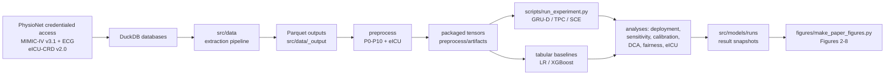

# SEPSIS-MM-DYN

Reproducible code for **dynamic 24-hour mortality prediction in sepsis**,
comparing a 12-lead-ECG-augmented multimodal deep model against clinical-only
and tabular baselines, with an external evaluation in eICU.

> Companion to the manuscript:
> *"Tabular models outperform deep learning in this sepsis cohort, and 12-lead
> electrocardiography adds no incremental value in this evaluation: a
> protocol-frozen, externally evaluated study of dynamic 24-hour mortality
> prediction."*
>
> Protocol preregistration (time-locked OSF project):
> [https://osf.io/keh57](https://osf.io/keh57) ·
> DOI [10.17605/OSF.IO/KEH57](https://doi.org/10.17605/OSF.IO/KEH57)

## Highlights

- **Cohort.** 31,910 sepsis episodes from MIMIC-IV v3.1; 443,225 six-hourly
  landmarks; 2.34% 24-hour mortality.
- **Models.** GRU-D and TPC encoders with and without a 12-lead ECG encoder
  (SCE multimodal fusion), plus logistic regression and XGBoost tabular
  baselines, and a DeepHit competing-risk model.
- **Key results.** Tabular models outperformed every deep model
  (LR iAUROC 0.8657; XGBoost 0.8760; frozen SCE 0.8423). The prespecified
  paired comparison did not confirm an ECG increment
  (ΔiAUROC +0.0063; 95% CI −0.0023 to +0.0183); an availability-only control
  explained most of the deployment gain, and handcrafted ECG features added
  nothing to the tabular baselines.
- **External evaluation.** In eICU-CRD v2.0, XGBoost reached
  iAUROC 0.8237–0.8297 versus 0.704–0.707 for the frozen deep model.

See [docs/RESULTS_MAP.md](docs/RESULTS_MAP.md) for the exact mapping between
every manuscript figure/table and the script that produces it.

## Repository layout

```
.
├── src/
│   ├── data/            # DuckDB extraction pipeline (MIMIC-IV, eICU-CRD)
│   ├── models/          # encoders (GRU-D, TPC, ECG ResNet), fusion (SCE, DeepHit),
│   │   │                # training loop, dataset, reported result snapshots
│   │   └── evaluation/  # calibration, DCA, subgroup interaction, power analysis
│   └── ...
├── preprocess/          # P0–P10 preprocessing pipeline + eICU branch
├── scripts/             # one entry point per analysis (train, baselines, sensitivity…)
├── figures/             # make_paper_figures.py regenerates Figures 2–8
├── configs/             # local path template + frozen protocol metadata
├── docs/
│   ├── protocols/       # the project's protocol & implementation documents (Chinese)
│   ├── DATA_ACCESS.md
│   ├── REPRODUCIBILITY.md
│   └── RESULTS_MAP.md
├── notebooks/           # environment smoke-test notebook
├── requirements.txt
├── environment.yml
└── CITATION.cff
```

## Pipeline overview



## Data availability

No patient data is stored in this repository. All analyses require
credentialed PhysioNet access:

| Dataset | Version | Used for |
|---|---|---|
| MIMIC-IV | v3.1 | Development cohort, landmarks, labels |
| MIMIC-IV-ECG | v1.0 | 12-lead ECG waveforms |
| eICU-CRD | v2.0 | External evaluation |

See [docs/DATA_ACCESS.md](docs/DATA_ACCESS.md) for access steps and the
required DuckDB layout. Because the datasets' data-use agreements prohibit
redistribution, no extracted parquet, tensor, prediction, or checkpoint file
is tracked by git (see `.gitignore`).

## Installation

Python 3.11 is recommended (developed on 3.11.7). GPU is optional; all models
can train on CPU, with considerably longer runtimes for the deep models.

```bash
python -m venv .venv
# Windows:
.venv\Scripts\activate
# Linux/macOS:
source .venv/bin/activate

pip install -r requirements.txt
```

Or with conda:

```bash
conda env create -f environment.yml
conda activate sepsis-mm-dyn
```

### Configure local database paths

```bash
cp configs/local_paths.example.yaml preprocess/configs/local_paths.yaml
# then edit preprocess/configs/local_paths.yaml
```

or export `MIMIC_DB`, `EICU_DB`, `ECG_WFDB_ROOT`.

## Quick start

```bash
# 1. Extract features from the DuckDB databases
python src/data/main.py all

# 2. Preprocess into model-ready tensors
cd preprocess
python src/run.py            # P0 -> P10 (+ eICU branch: --step eicu)
cd ..

# 3. Train (smoke test first, then full)
python scripts/run_experiment.py --mode smoke
python scripts/run_experiment.py --mode full

# 4. Run the remaining analyses (Deployment / DeepHit / sensitivity / eICU…)
python scripts/run_all_analysis.py

# 5. Regenerate Figures 2-8 from the result snapshots
python figures/make_paper_figures.py
```

Detailed commands, runtimes, seeds, and verification targets are in
[docs/REPRODUCIBILITY.md](docs/REPRODUCIBILITY.md).

## Reported results

Aggregate result snapshots (AUROC/Brier/DCA/calibration/fairness metrics only;
no patient-level files) are shipped under `src/models/runs/**` so that
Figures 2–8 and the manuscript tables can be checked without retraining.
The per-patient predictions (`predictions.npz`) and model checkpoints
(`*.pt`) that were used to produce them are excluded under the PhysioNet
data-use agreement; rerun the training scripts to regenerate them.

## License

Code is released under the [MIT License](LICENSE).

## Citation

See [CITATION.cff](CITATION.cff) (update author list, ORCID, and repository URL
before release).

## Contact

- Corresponding author: Xuming Pan, 20194112@zcmu.edu.cn
- Issues: please open a GitHub issue in this repository.
